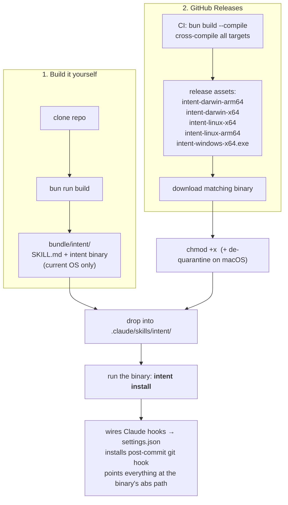

# Bun migration plan

Move `intent` from **Node + `node:sqlite`** to **Bun** — for building, running, testing, and
shipping a **single-file binary**. Decided direction (2026-06-14):

- **Runtime: Bun-only.** Rewrite the (small) DB layer onto `bun:sqlite`; drop `node:sqlite` and
  the `--experimental-sqlite` flag entirely.
- **Distribution: build-it-yourself + GitHub Releases**, both ending at "run the binary to set
  itself up" (`intent install`). No more `node install.mjs`, no PATH shims, no `.cmd`/`.ps1`.

## Why

The project's pain is almost entirely *install plumbing* born from "portable JS needs Node":
the `--experimental-sqlite` flag, PATH shims, the Windows `.cmd`/`.ps1` dance, and GUI git
clients that can't find `node`. A native binary makes all of that evaporate — the executable is
self-contained and self-installing.

### Verified on Bun 1.3.11 (macOS arm64)

| Capability | Result |
| --- | --- |
| `node:sqlite` under Bun | ❌ `Could not resolve "node:sqlite"` — **forces the rewrite** |
| `bun:sqlite` | ✅ CRUD, **FTS5 + bm25**, `PRAGMA user_version`, prepared stmts |
| `bun build --compile` | ✅ working single-file binary, **~58 MB** (embeds the Bun runtime), per-platform |
| DB API surface to port | `.prepare/.exec/.run/.get/.all/.close` + 2 type imports — tiny, isolated |

### Trade-offs accepted

- Binary is **~58 MB** and **OS+arch specific** (not interchangeable). That's the price of zero
  runtime deps.
- `node:sqlite`'s "runs anywhere Node is" portability is gone. Replaced by per-platform binaries.

## Distribution model

Both paths converge on **`intent install`** — setup is a subcommand of the binary itself.

- **Source build** produces a binary for the *current* OS only (`intent.exe` on Windows,
  `intent` elsewhere). Requires Bun on the build machine.
- **Releases** ship all targets; the user grabs the one matching their platform.
- The skill folder still holds **`SKILL.md`** (unchanged — it's just instructions). Hooks point
  at the binary's **absolute path** inside the skill dir → **no PATH shims at all**.

### Known frictions (document, don't block)

1. **Source build needs Bun.** Keep an `npm run build` alias that shells to `bun` for muscle memory.
2. **Chicken-and-egg `chmod +x` (mac/linux Releases path):** `chmod +x intent && ./intent install`.
   Windows: `.\intent.exe install`. Unavoidable — you need it executable to run the installer.
3. **Gatekeeper / SmartScreen** quarantine downloaded binaries → "developer cannot be verified."
   Unsigned: macOS users run `xattr -d com.apple.quarantine intent` once (or right-click→Open).
   Source-built binaries are unaffected. Code-signing is a later nice-to-have ($).

## Work phases

### Phase 0 — Spike & toolchain (small)
- Add Bun as the dev toolchain. `bunfig.toml` if needed.
- Confirm `bun run <file>.ts` runs TS directly (no build step for dev).
- Decide TS config story: keep `tsc --noEmit` for typecheck; Bun handles execution/bundling.

### Phase 1 — DB layer port to `bun:sqlite` (the core change)
Files: `src/db/connection.ts`, `src/db/schema.ts`, `src/db/intents.ts`.
- Swap `import { DatabaseSync } from "node:sqlite"` → `import { Database } from "bun:sqlite"`.
- API deltas to handle:
  - `new DatabaseSync(path, { readOnly })` → `new Database(path, { readonly })` (option renamed).
  - Replace type `DatabaseSync` → `Database`; introduce a local `IntentDatabase` alias (already
    exists in `connection.ts`) so the rest of the code is insulated.
  - Replace `SQLOutputValue` type import (`intents.ts`) with a local type (e.g.
    `type SqlValue = string | number | bigint | Uint8Array | null`).
  - Verify `.prepare/.exec/.run/.get/.all/.close` semantics match (they do in the spike).
  - Keep the hand-rolled `transaction()` BEGIN/COMMIT/ROLLBACK — still valid.
- **Acceptance:** WAL on, migrations apply via `PRAGMA user_version`, FTS5 search (`bm25`,
  `toFtsQuery`) works.

### Phase 2 — Tests onto Bun
- 13 `*.test.ts` files currently on vitest with `--experimental-sqlite`.
- Choose: **`bun test`** (Jest-like; fast, native `bun:sqlite`) — preferred — or keep vitest run
  under Bun. `bun test` means porting `vi.*`/`describe/it/expect` usages.
- Drop `NODE_OPTIONS="--experimental-sqlite"` from the test scripts.
- **Acceptance:** full suite green under `bun test`.

### Phase 3 — Build → single binary
- `bun build src/cli/main.ts --compile --outfile bundle/intent/intent` (current OS).
- Cross-compile targets via `--target=bun-{darwin-arm64,darwin-x64,linux-x64,linux-arm64,windows-x64}`.
- Rework `package.json` scripts: `build` → bun compile; `bundle` → assemble skill folder + binary;
  `typecheck` stays `tsc --noEmit`.
- **Note:** `intent-hook` (second bin) — fold into the main binary as a hidden subcommand
  (`intent hook ...`) so there's **one** binary, or compile a second. Prefer folding to one.

### Phase 4 — Self-installing binary (`intent install`)
- New subcommand `intent install` absorbs `scripts/install.mjs` logic:
  - Wire Claude Code hooks (`SessionStart` / `PreToolUse` / `PostToolUse`) into `settings.json`,
    pointing at **this binary's absolute path** (`process.execPath`) — no shims.
  - Install the post-commit git hook (reuse existing `install-commit-hook` command; it already
    pins an executable path — now points at the binary, not `node main.js`).
  - Flags to preserve: `--dry-run`, `--project`, `--settings`, `--no-commit-hook`.
- Delete `scripts/install.mjs`, the `.cmd`/`.ps1`/POSIX shim code, and its tests.
- Update `src/cli/commands.ts:324` (commit-hook script) to invoke the binary directly — drop
  `--experimental-sqlite --no-warnings`.

### Phase 5 — Bundle + Releases
- `scripts/bundle.mjs` → emit `bundle/intent/` = `SKILL.md` + binary (current OS) + `README.md`.
  `bundle/intent-backfill/` stays SKILL-only.
- GitHub Actions workflow: on tag, cross-compile all targets, attach to a Release.
- README: install steps for both paths incl. the `chmod +x` / de-quarantine notes.

### Phase 6 — Docs & cleanup
- Update `CLAUDE.md`, `docs/claude-code-integration.md`, examples: no `node`, no flag, binary path.
- Remove `node:sqlite` / `--experimental-sqlite` mentions across the repo.
- Update `specs/cli-pivot-plan.md` status to reflect the Bun era.

## Open questions / later
- **Code signing** (macOS notarization, Windows Authenticode) to kill Gatekeeper/SmartScreen — later.
- **Binary size:** 58 MB is inherent to `--compile`. Acceptable; revisit if Bun adds slimming.
- **`@types/node`** still useful for `node:*` builtins we keep (`child_process`, `fs`, `path`) —
  Bun supports those, keep the types.

## Risk register
| Risk | Likelihood | Mitigation |
| --- | --- | --- |
| `bun:sqlite` behaviour differs subtly from `node:sqlite` | low | spike passed; full test suite in Phase 2 |
| `bun test` migration churn from vitest | med | small files; can fall back to vitest-under-bun |
| Cross-compile target gaps (e.g. linux-arm64) | low | verify each in CI before first Release |
| Single-binary-for-hook UX on Windows | med | binary needs no shim; test under Git-for-Windows + GUI clients |
