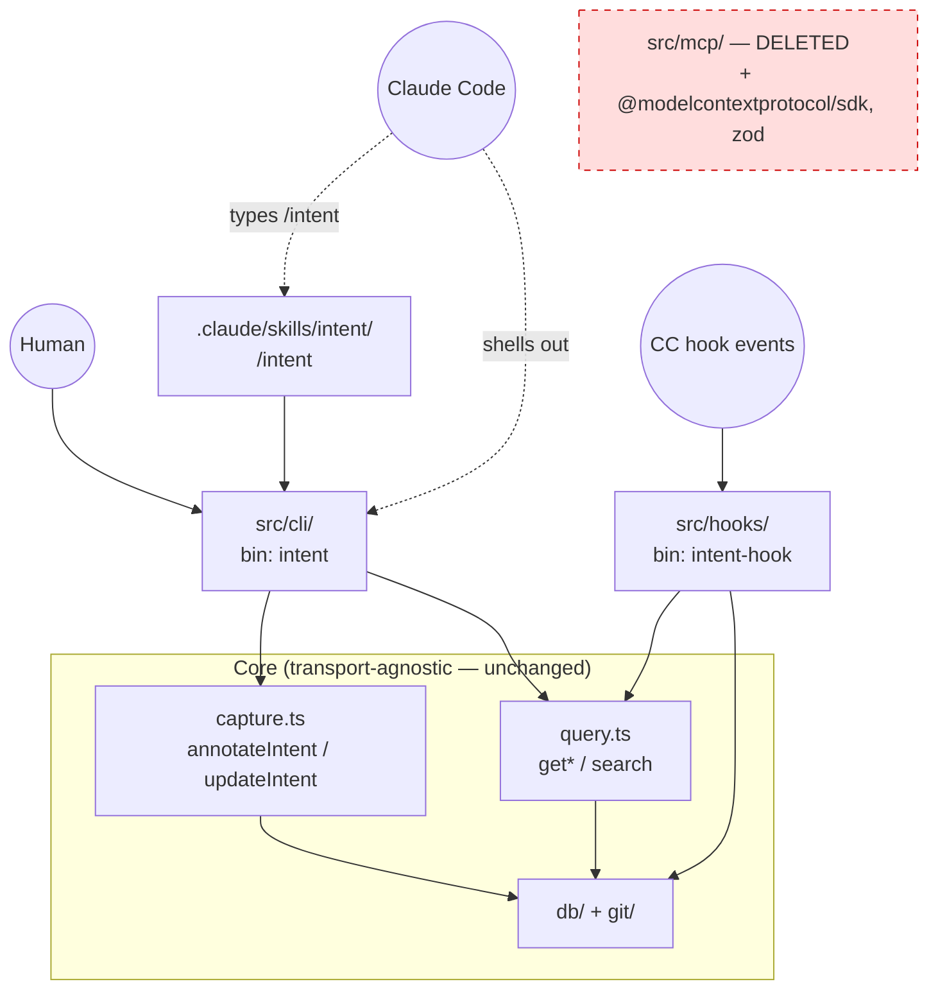
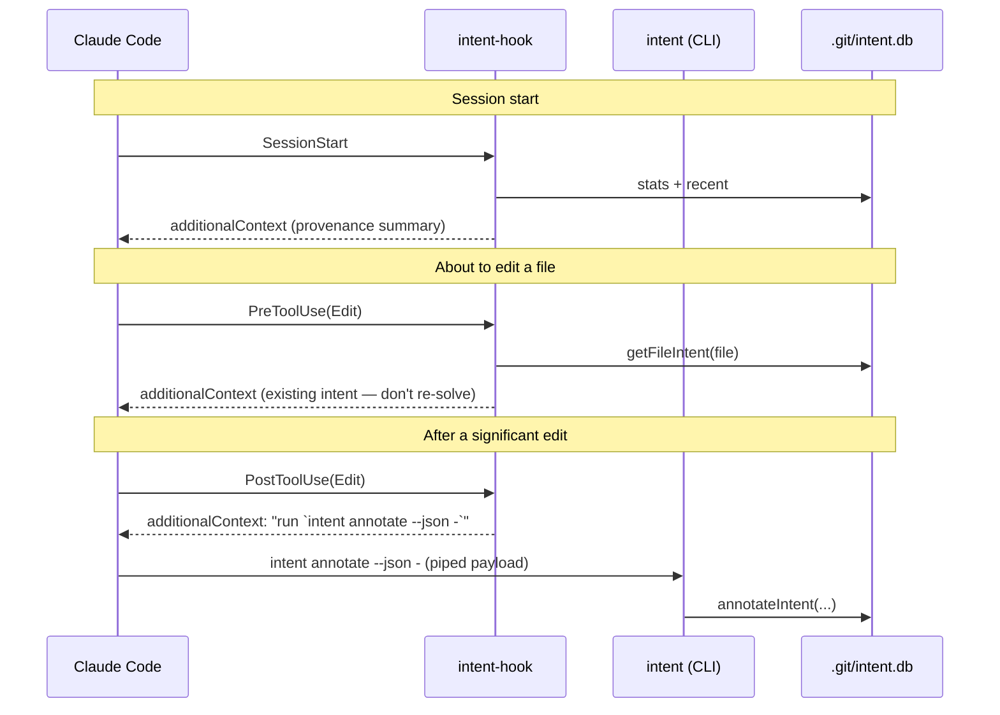

# Plan — Pivot from MCP server to a droppable `intent` skill

> Status: in progress (Phases 1–3 done). Supersedes milestones M5–M7 in
> [mcp-intent-spec.md](mcp-intent-spec.md).
>
> Decisions:
> - Drop the MCP server entirely; rename `mcp-intent` → `intent`.
> - Hand-rolled zero-dep CLI as the single interface for humans + Claude.
> - **Swap `better-sqlite3` → `node:sqlite`** (built-in, sync, FTS5+bm25 verified) so the
>   tool is pure JS with zero runtime deps — no native compile, no `node_modules`.
> - Ship as a **self-contained skill bundle** droppable into any `.claude/skills/`
>   (project or `~/.claude`), with an `install.mjs` that wires hooks + PATH shims.

## Why

The thing is per-repo. Running a long-lived MCP server process for every repo on the
machine is silly when the work is "shell out to a tiny tool against `.git/intent.db`".

Three facts make this cheap:

1. **The core is already transport-agnostic** — `src/capture.ts` + `src/query.ts` hold all
   the logic; MCP was just a lid over them. The CLI bolts onto the identical functions.
2. **The hooks already bypass MCP** — `src/hooks/handler.ts` calls `db` + `query` directly,
   zero MCP dependency. The deterministic capture/inject loop survives untouched.
3. **`zod` + `@modelcontextprotocol/sdk` are confined to `src/mcp/`** — removing MCP drops
   the dependency tree to a single runtime dep: `better-sqlite3`.

## Target architecture



Capture/inject loop after the pivot (no server process anywhere):



## CLI surface (`bin: intent`)

Default output is human-readable; `--json` is machine-readable (what Claude uses).
Writes accept a JSON payload on stdin so multiline `detail` / quotes never hit shell escaping.

| Command | Maps to | Notes |
|---|---|---|
| `intent annotate --json -` | `annotateIntent` | reads JSON payload from stdin; prints new `intent_id` |
| `intent update --json -` | `updateIntent` | append/replace detail on an existing intent |
| `intent show <file>:<line>` | `getIntentAtLine` | intent at a current line position |
| `intent file <file>` (alias `log`) | `getFileIntent` | full provenance for a file |
| `intent search <query> [--file f] [--limit n]` | `searchIntent` | FTS5 search |
| `intent session <id>` | `getSessionIntent` | what a session did + why |
| `intent stats` | `getStats` | repo summary |
| `intent export [--format json]` | (new, folds in old M7) | ndjson to stdout |

Write payload contract (`annotate`):

```json
{ "file": "src/x.ts", "line_start": 10, "line_end": 24,
  "summary": "…", "detail": "…", "task_ref": "GH-142",
  "intent_id": "…optional, attach multi-file task…",
  "session_id": "…from MCP_INTENT_SESSION_ID…" }
```

## Distribution — the droppable skill bundle

Built output is a self-contained directory copied into any `.claude/skills/`:

```
intent/
  SKILL.md                    /intent + capture convention (Phase 3)
  dist/                       compiled JS — pure node:sqlite, no node_modules
  bin/intent                  shim: NODE_NO_WARNINGS=1 node --experimental-sqlite <dist>/cli/main.js "$@"
  bin/intent-hook             shim: same, → dist/hooks/cli.js
  install.mjs                 one-shot setup (node — present by definition)
```

`install.mjs` is idempotent and does three things:
1. Merge the 3 hooks (SessionStart / PreToolUse / PostToolUse) into the target
   `settings.json` **without clobbering** existing hook entries.
2. Drop `intent` + `intent-hook` shims onto PATH (`~/.local/bin`), so humans and Claude
   both just call `intent`.
3. Write the hook `command` as the absolute shim path — no PATH assumption for the hook.

Shims bake in `--experimental-sqlite` + `NODE_NO_WARNINGS=1` so the experimental flag and
its warning never leak. (Flag is a no-op / unneeded on node ≥ 23.4.)

## Phases

### Phase 1 — CLI spine ✅ DONE
`src/cli/` (parse, format, commands, main), `bin: intent`, JSON-on-stdin writes, 22 tests.

### Phase 2 — Rewire hooks ✅ DONE
Hook nudges name CLI commands; bin `mcp-intent-hook` → `intent-hook`; example + live configs updated.

### Phase 3 — Skill ✅ DONE
`.claude/skills/intent/SKILL.md` — `/intent`, CLI surface, capture convention, heredoc capture pattern.
*(Outstanding: PATH allow-list entry in `settings.local.json` was classifier-denied; needs user ok.)*

### Phase 4 — DB driver swap (`better-sqlite3` → `node:sqlite`) ✅ DONE
- [x] `connection.ts`: `DatabaseSync`, `transaction()` helper (manual BEGIN/COMMIT/ROLLBACK),
      `getUserVersion()` via `PRAGMA`. FK on by default.
- [x] `intents.ts`: row interfaces gained a `[column: string]: SQLOutputValue` index signature so
      they double as bind params + result cast target. Named-param `.run(row)` works unchanged.
- [x] `capture.ts`: switched to the `transaction()` helper.
- [x] All 74 tests pass (FTS5 triggers + bm25 + cascade intact). `better-sqlite3` removed.
- [x] `npm test` runs under `NODE_OPTIONS=--experimental-sqlite --no-warnings`.
- Note: on node 22.18 `node:sqlite` works *without* the flag (warns only); shim keeps `--no-warnings`.

### Phase 5 — Remove MCP (was 4) ✅ DONE
- [x] Deleted `src/mcp/` + stale `dist/mcp/`; dropped `mcp-intent-server` bin, `@modelcontextprotocol/sdk`, `zod`.
- [x] Deleted `.mcp.json` + `examples/.mcp.json`; stripped `enabledMcpjsonServers` + `mcp__intent__*` perms.
- [x] Removed `createIntentServer` from the barrel; rewrote docs (CLI + hooks + skill); updated CLAUDE.md.
- [x] **`dependencies: {}`** — zero runtime deps. 69 tests pass, typecheck clean.

### Phase 6 — Rename `mcp-intent` → `intent` (was 5)
- [ ] `package.json` name. CLAUDE.md, spec, docs, README refs.
- [ ] `MCP_INTENT_SESSION_ID` → `INTENT_SESSION_ID` (keep old as fallback; CLI already reads both).

### Phase 7 — Bundle + `install.mjs` (distribution) **[NEW — replaces npm-link]**
- [ ] Build step assembles the `intent/` skill bundle (SKILL.md + dist + bin shims + install.mjs).
- [ ] `install.mjs`: settings.json hook merge, PATH shims, idempotent, `--dry-run`.
- [ ] Dogfood: install into this repo's `.claude` and a throwaway repo.

### Phase 8 — Post-commit hook (was M6)
- [ ] `intent-hook` gains a post-commit mode backfilling `commit_hash` where NULL, matched by `blob_hash`.

### Phase 9 — Export ✅ effectively done
`intent export` (ndjson) landed in Phase 1; revisit only if cross-repo ingest needs a different shape.

## Files: add / change / delete

- **Add**: `src/cli/*` ✅, `.claude/skills/intent/SKILL.md` ✅, `install.mjs`, `bin/` shims
- **Change**: `src/hooks/*` ✅, `src/db/*` (node:sqlite swap), `src/capture.ts` (txn), `package.json`,
  CLAUDE.md, spec, docs, examples
- **Delete**: `src/mcp/`, `.mcp.json`, `better-sqlite3` + `@modelcontextprotocol/sdk` + `zod` deps

## Risks / watch-outs

- **Model invocation reliability** — shelling out to a CLI is slightly more brittle than a
  structured MCP tool call. Mitigated by JSON-stdin (no escaping) + a terse, exact command in
  the hook's `additionalContext`. Verify with a real edit→annotate round-trip once wired.
- **Permission prompts** — the model running `intent annotate …` each significant edit may
  prompt. Add an allowlist entry for `intent` in project `.claude/settings.json` (or
  `/fewer-permission-prompts` after the fact).
- **Reversibility** — core stays agnostic, so an MCP lid is a ~30-min resurrect if a non-Claude
  client ever needs it. We're not burning the bridge, just not paying for it per-repo.
