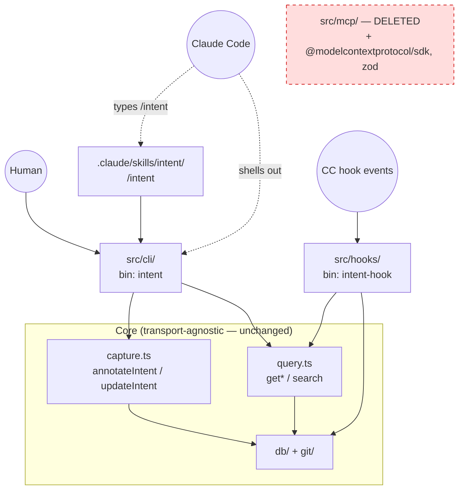
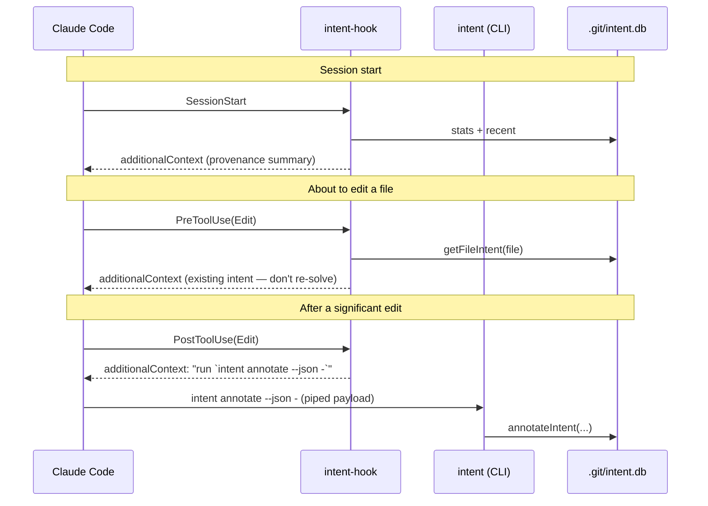

# Plan — Pivot from MCP server to CLI + skill

> Status: proposed. Supersedes milestones M5–M7 in [mcp-intent-spec.md](mcp-intent-spec.md).
> Decision: drop the MCP server entirely, rename the package `mcp-intent` → `intent`,
> hand-rolled zero-dep CLI as the single interface for both humans and Claude.

## Why

The thing is per-repo. Running a long-lived MCP server process for every repo on the
machine is silly when the work is "shell out to a tiny tool against `.git/intent.db`".

Three facts make this cheap:

1. **The core is already transport-agnostic** — `src/capture.ts` + `src/query.ts` hold all
   the logic; MCP was just a lid over them. The CLI bolts onto the identical functions.
2. **The hooks already bypass MCP** — `src/hooks/handler.ts` calls `db` + `query` directly,
   zero MCP dependency. The deterministic capture/inject loop survives untouched.
3. **`zod` + `@modelcontextprotocol/sdk` are confined to `src/mcp/`** — removing MCP drops
   the dependency tree to a single runtime dep: `better-sqlite3`.

## Target architecture



Capture/inject loop after the pivot (no server process anywhere):



## CLI surface (`bin: intent`)

Default output is human-readable; `--json` is machine-readable (what Claude uses).
Writes accept a JSON payload on stdin so multiline `detail` / quotes never hit shell escaping.

| Command | Maps to | Notes |
|---|---|---|
| `intent annotate --json -` | `annotateIntent` | reads JSON payload from stdin; prints new `intent_id` |
| `intent update --json -` | `updateIntent` | append/replace detail on an existing intent |
| `intent show <file>:<line>` | `getIntentAtLine` | intent at a current line position |
| `intent file <file>` (alias `log`) | `getFileIntent` | full provenance for a file |
| `intent search <query> [--file f] [--limit n]` | `searchIntent` | FTS5 search |
| `intent session <id>` | `getSessionIntent` | what a session did + why |
| `intent stats` | `getStats` | repo summary |
| `intent export [--format json]` | (new, folds in old M7) | ndjson to stdout |

Write payload contract (`annotate`):

```json
{ "file": "src/x.ts", "line_start": 10, "line_end": 24,
  "summary": "…", "detail": "…", "task_ref": "GH-142",
  "intent_id": "…optional, attach multi-file task…",
  "session_id": "…from MCP_INTENT_SESSION_ID…" }
```

## Phases

### Phase 1 — CLI spine
- [ ] `src/cli/parse.ts` — tiny hand-rolled arg/subcommand parser (no commander).
- [ ] `src/cli/format.ts` — human vs `--json` output formatters (reuse the `serialize`
      shape currently in `mcp/server.ts:29` before that file dies).
- [ ] `src/cli/commands.ts` — one handler per command over `capture` / `query` / `db`.
- [ ] `src/cli/main.ts` — entry, `bin: intent`. Resolve repo root + open db like the hook does.
- [ ] Tests: parser + each command (human + `--json`).

### Phase 2 — Rewire hooks
- [ ] Update nudge strings in `src/hooks/handler.ts` (`buildSessionStartContext`,
      `buildPreEditContext`, `buildPostEditReminder`) to name CLI commands, not MCP tools.
      e.g. PostToolUse → "run `intent annotate --json -` with {file,line_start,…}".
- [ ] Rename bin `mcp-intent-hook` → `intent-hook`.
- [ ] Fix the hook tests asserting the old "call annotate_intent" wording.

### Phase 3 — Skill (human-driven + teaches the convention)
- [ ] `.claude/skills/intent/SKILL.md` — `/intent` for ad-hoc human queries; documents the
      full CLI surface and the capture convention/significance threshold. The auto-loop does
      **not** depend on this (hooks carry the command inline) — it's the on-demand wrapper.

### Phase 4 — Remove MCP
- [ ] Delete `src/mcp/` (server, stdio, tests).
- [ ] `package.json`: drop `mcp-intent-server` bin, drop `@modelcontextprotocol/sdk` + `zod`.
- [ ] Delete `.mcp.json`; update `examples/` + `docs/claude-code-integration.md` (hooks only now).

### Phase 5 — Rename `mcp-intent` → `intent`
- [ ] `package.json` name + bins. CLAUDE.md, spec, docs, README refs.
- [ ] Keep `MCP_INTENT_SESSION_ID` env var name for back-compat, or rename to
      `INTENT_SESSION_ID` (decide during phase).

### Phase 6 — Post-commit hook (was M6)
- [ ] `intent-hook` gains a post-commit mode (or a dedicated subcommand) backfilling
      `commit_hash` where NULL, matched by `blob_hash`. Optional install, not forced.

### Phase 7 — Export (was M7)
- [ ] `intent export` already specced in Phase 1 surface; ndjson stream for cross-repo.

## Files: add / change / delete

- **Add**: `src/cli/*`, `.claude/skills/intent/SKILL.md`
- **Change**: `src/hooks/handler.ts` + `cli.ts`, `package.json`, CLAUDE.md, spec, docs, examples
- **Delete**: `src/mcp/`, `.mcp.json`

## Risks / watch-outs

- **Model invocation reliability** — shelling out to a CLI is slightly more brittle than a
  structured MCP tool call. Mitigated by JSON-stdin (no escaping) + a terse, exact command in
  the hook's `additionalContext`. Verify with a real edit→annotate round-trip once wired.
- **Permission prompts** — the model running `intent annotate …` each significant edit may
  prompt. Add an allowlist entry for `intent` in project `.claude/settings.json` (or
  `/fewer-permission-prompts` after the fact).
- **Reversibility** — core stays agnostic, so an MCP lid is a ~30-min resurrect if a non-Claude
  client ever needs it. We're not burning the bridge, just not paying for it per-repo.
